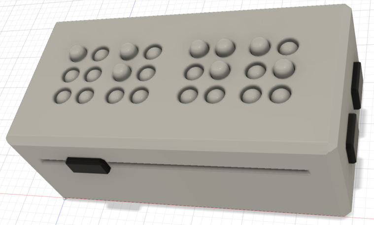

# The Haptic Chronometer - A Braille based alarm clock

### for lecture "Advanced User Interfaces"

Prof. Dr. Ernst Kruijff, WiSe 2025

## proposed Features

- Polyester covered front?
- HH : MM in braile
- button for announced time
- alarm (or timer?)
	- set by silder(s) in the back of the clock
	- (beeps)
- short info on weather, audio or braille?
- [design document](dd.md)

(12:45)

## BOM

- case
	- 3D printed?
- moving parts
	- pins
	- height-adjusting sliders
	- servo with gears
- inputs
	- button
		1. to activate time announcement
		2. to activate weather announcement
		3. toggle alarm
	- slider
		1. set hours of alarm
		2. set minutes
- further outputs
	- speaker + soundboard
- control & power
	- some ESP32
		- WIFI to get time and weather data
		- lots of pins
		- OTA possible
	- power supply
		- probably 5v, depending on used motors/actuators
		- battery?
- [full BOM](bom.md)

## Team

- Loujin Abuhejleh
- Raphael Kuhn
